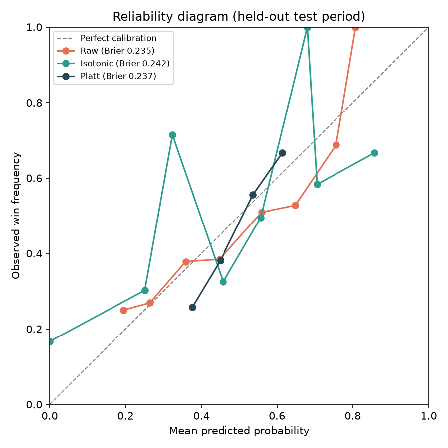

# Sports Market Efficiency & Arbitrage Engine

Sportsbook odds are prices in a prediction market. This project treats them
that way: **implied probability is price**, **vig is bid-ask spread**,
**cross-book arbitrage is cross-venue arbitrage**, and **Kelly sizing is
position sizing under an estimated edge and its uncertainty**. It's a
research/backtesting pipeline — data ingestion, a probability model, a
backtest, and risk-managed sizing — built as a quant-trading portfolio piece,
not a betting product.

*Built with Claude Code as a development tool: I directed scope and data
decisions, reviewed and approved each phase, and made the calls at every
decision point; Claude implemented most of the code. I can walk through and
defend every module.*

## TL;DR

- **The pipeline is real end-to-end**, not a toy: a live Odds API key, a real
  arbitrage scan against actual multi-book prices, and a real predictive
  model trained on 1,444 real MLB games — not just a notebook that runs once
  on a CSV someone else cleaned.
- **The real model doesn't beat a coin flip on held-out data (49.0% vs.
  47.9%), and that's reported as the finding, not tuned away** — the README
  says why (team-level stats can't see the starting-pitcher effect that
  dominates single-game MLB outcomes) instead of quietly swapping in a
  friendlier number. This is the single best "how do you know you're not
  fooling yourself" answer in the project.
- **A tail-risk check the backtest runs automatically caught its own fake
  result**: a calibration variant posted a flashy +33% ROI until
  `top_bet_pnl_share` showed 136% of that profit came from one lucky
  long-odds bet. Built the check *because* it caught something, not as a
  box to tick.
- **CLV, not ROI, is the headline metric** — on the synthetic backtest, raw
  ROI was negative (-5.5%) but average CLV was positive with a bootstrap
  confidence interval that clears zero (+2.64pp, 90% CI [+1.78, +3.49]);
  ROI's own CI doesn't. That gap *is* the thesis of the project, demonstrated
  with real numbers, not just asserted.
- **The isotonic-vs-Platt calibration finding reproduced independently on
  two unrelated datasets** (synthetic NBA, real MLB) — same pattern both
  times, which is what makes it a real finding about small calibration sets
  rather than a one-off fluke worth a footnote.
- Full detail on every point above is below, in "Real MLB model" and
  "Results: synthetic NBA backtest."

## Why this framing

A sportsbook quoting -110 on both sides of a game is doing exactly what a
market maker does quoting a bid-ask spread: pricing both outcomes above their
fair value so it profits regardless of the result. "Beating the market" here
means the same thing it means in any market — not being right about outcomes
in isolation, but being right *relative to the price*, consistently, in a way
that survives transaction costs (the vig) and shows up before the market has
fully priced in the same information (i.e., before the closing line).

## Pipeline

| Module | What it does |
|---|---|
| `src/probability.py` | American odds → implied probability; strips the vig from a two-way market to get the "fair" no-vig probability |
| `src/vig.py` | Vig (overround) per market, as a percentage — the book's built-in edge |
| `src/odds_client.py` | Wraps [The Odds API](https://the-odds-api.com/); saves timestamped raw pulls to `data/raw/` |
| `src/utils.py` | Team name normalization and timestamp helpers, so odds from different books join on the same game |
| `src/arbitrage.py` | Scans every cross-book pair on a game for a guaranteed-profit mispricing (summed implied probability < 1) |
| `src/model.py` | Logistic regression win-probability model, fit only on a chronological training period, evaluated on a never-touched held-out test period |
| `src/kelly.py` | Full and fractional (half-Kelly) position sizing from model probability and offered odds |
| `src/clv.py` | Closing line value: implied probability at bet time vs. at market close |
| `src/backtest.py` | Walks the held-out test period, sizes flagged bets, simulates bankroll with realistic frictions, logs CLV per bet |
| `src/baselines.py` | Naive predictors (trust the market, always home, coin flip) the model has to actually beat |
| `src/calibration.py` | Reliability diagrams and isotonic/Platt recalibration — is the model's raw probability trustworthy enough to size bets with? |
| `src/stats.py` | Bootstrap confidence intervals for backtest metrics on a small sample |
| `src/mlb_stats_client.py` | Wraps the free, public MLB Stats API (`statsapi.mlb.com`) for real completed-game results |
| `src/mlb_features.py` | Point-in-time (no-lookahead) feature engineering on real MLB games — see "Real MLB model" below |

Three commands run it end-to-end:

```bash
python scripts/fetch_odds.py --sport baseball_mlb   # pull live odds (needs ODDS_API_KEY in .env)
python scripts/run_backtest.py                      # synthetic NBA: train, backtest, write results/
python scripts/train_mlb_model.py                   # real MLB: fetch, train, evaluate, write results/
```

## A note on data

| Piece | Status |
|---|---|
| Live odds (arbitrage scanner) | **Real.** The Odds API, live key. |
| Win-probability model | **Real.** Trained on real MLB games (`statsapi.mlb.com`). |
| Backtest / CLV / Kelly sizing | **Synthetic**, structurally — see why. |

NBA is off-season (nothing live until October) and `stats.nba.com`/`nba_api`
are unreachable from this environment anyway, so the default sport is
`baseball_mlb`: The Odds API covers real odds, and the free `statsapi.mlb.com`
covers real team stats and outcomes.

The backtest/CLV/Kelly sizing can't follow the same path: they need real
*historical* odds (the price at bet time and at close, for games already
played), and The Odds API's historical endpoint requires a paid plan
(confirmed directly — a real request returns
`HISTORICAL_UNAVAILABLE_ON_FREE_USAGE_PLAN`). Real *current* odds don't help
retroactively. So `data/processed/nba_games_synthetic.csv` (hidden per-team
"true strength," an opening line noisier than the closing line, by design)
still backs `scripts/run_backtest.py` and the backtest results below — a
paid plan or forward-collecting real lines from today are the only real fixes.
Both synthetic datasets are generated by committed scripts
(`scripts/generate_synthetic_nba_data.py`,
`scripts/generate_synthetic_arbitrage_sample.py`, both seeded and
reproducing the committed files byte-for-byte) rather than taken on faith.

## Live data: verified against a real Odds API pull

A real pull (`baseball_mlb`, `2026-07-16`) returned 4 games across up to 9
books each. `arbitrage.scan_games_for_arbitrage` found **0 opportunities** —
consistent with the synthetic result, this time on an actual live market.
Vig by book ranged 2.2% (BetUS) to 5.1% (BetMGM), with offshore/low-margin
books (BetUS, BetOnline, LowVig — no coincidence) pricing tighter than
mainstream US books — directionally sensible on a small sample (1-4 games
per book). The raw pull isn't committed (`data/raw/*` stays gitignored
except the synthetic sample) — redistributing a paid provider's live feed
doesn't belong in a public repo even on the free tier. Pull your own with
`scripts/fetch_odds.py`.

## Real MLB model: an honest null result

`scripts/train_mlb_model.py` fetches every completed 2026 game from
`statsapi.mlb.com` (1,444 games) and trains a logistic regression on
point-in-time features — rolling runs scored/allowed, season run
differential, last-10 win rate, and rest days, all home-minus-away diffs
computed only from games strictly before the one predicted
(`mlb_features.py`, tested directly: a later game's score can never change
an earlier row). Home team is fixed by the real data, so home advantage is
absorbed into the model's intercept rather than a separate feature.

**Result on 286 real held-out games (2026-06-22 to 2026-07-12):**

| Predictor | Accuracy | Log loss | Brier score |
|---|---|---|---|
| Model (logistic regression) | 49.0% | 0.6958 | 0.2513 |
| Always predict home team (training home-win rate) | 47.9% | 0.6977 | 0.2523 |
| Coin flip | 47.9% | 0.6931 | 0.2500 |

Bootstrap 90% CI on accuracy: [44.1%, 53.5%] — straddles a coin flip. CI on
log-loss improvement over the home-rate baseline: [-0.0040, +0.0075] —
includes zero. **No statistically distinguishable edge over naive
baselines.** Likely reason: single-game MLB outcomes are driven heavily by
the **starting pitcher matchup**, which team-level rolling stats can't see
at all — unlike NBA, where a five-man rotation dilutes any one player's
effect. Starting-pitcher stats (ERA, FIP) are the obvious next feature,
available from the same free API — not added here, to avoid tuning the
model against the one held-out sample used to report it.

Full report: `results/mlb_model_report.md` (isotonic calibration is
visibly noisier than Platt here too, on an independent 172-game calibration
set — same small-sample pattern as the synthetic case, now seen twice).

## Results: synthetic NBA backtest

Backtest on the synthetic held-out test period (240 games, 94 bets flagged
by a 3-point model-vs-market edge threshold):

| Metric | Value |
|---|---|
| Avg CLV | **+2.64 pp** (90% CI [+1.78, +3.49]) |
| ROI | -5.5% (90% CI on mean per-bet return: [-1.26%, +2.11%]) |
| Hit rate | 29.8% |
| Sharpe-like ratio | 0.03 |
| Max drawdown | -49.7% |


Right-hand panel is mostly green: CLV was consistently positive even while
the bankroll trajectory (left) whipsawed on a real losing streak — the case
for CLV over ROI, visually.

**Model vs. naive baselines**, same held-out period — the real bar isn't
50%, it's the market's own no-vig price:

| Predictor | Accuracy | Log loss | Brier score |
|---|---|---|---|
| Model (logistic regression) | 59.2% | 0.6614 | 0.2345 |
| Always bet market favorite (no-vig price) | 62.9% | 0.6637 | 0.2328 |
| Always bet home team | 49.2% | 0.6994 | 0.2531 |
| Coin flip | 44.2% | 0.6931 | 0.2500 |

Edges the market on log loss, loses on accuracy and Brier — a wash, not a
rout, which is the expected honest result: a six-feature model dominating
the market's own price would be the red flag.

**Calibration.** The flagged bets skew toward underdogs (mean model
probability 0.44 vs. mean market 0.33) — a plausible sign of "finding
value" on long shots from imperfect calibration. Fit isotonic and Platt
recalibrators on a held-out 144-game calibration set and re-evaluated:



Neither meaningfully improved Brier score (raw 0.2353, isotonic 0.2424,
Platt 0.2368) — the raw model was already reasonably calibrated. Not the
result the hypothesis predicted, reported anyway. What the re-run *did*
catch: the Platt-calibrated backtest posted a flashy **+33% ROI**, until
`top_bet_pnl_share` showed **136% of that profit came from one long-odds
bet** — one lucky longshot, not an edge. Full report:
`results/backtest_report.md`.

## Design decisions worth defending in an interview

- **Chronological train/test split, never violated.** Structural, not a
  promise — `chronological_split` sorts by date and cuts a fixed fraction;
  the backtest only ever sees what falls after that cut.
- **Half-Kelly, not full Kelly.** Full Kelly is optimal only for a
  *correctly specified* edge, which a small logistic regression never has
  exactly. Trading some growth for a lot less variance is a deliberate,
  statable choice.
- **A hard bet-size cap independent of Kelly's output.** Kelly sizes up
  arbitrarily on a large estimated edge (see the underdog skew above); real
  books cap sharp bettors long before that, so the backtest does too. Still
  a -49.7% max drawdown at a 5% cap — "capped" isn't "safe," just safer.
- **Simulated slippage.** Odds are nudged against the bettor before a bet
  is "placed" — the price you decide on and the price you get rarely match.
- **CLV as the headline metric, not ROI, backed by a tail-risk check.** The
  check (`top_bet_pnl_share`) exists because it caught something real (the
  Platt +33%/136% case above), not as a box to tick.
- **Calibration tested, not assumed** — isotonic and Platt both fit and
  compared against the raw model, neither cherry-picked when it didn't win.
- **Point-in-time feature engineering, tested directly.** `test_mlb_features.py`
  literally changes a later game's score and asserts every earlier row is
  unchanged — "we tested it" beats "we wrote it carefully."
- **A null result reported as a null result.** The MLB model's non-finding
  is in the README, not dropped for the more flattering synthetic numbers.

## What this deliberately doesn't do

- No live or real-money betting integration — this is a research/backtesting
  project, not a betting app.
- No database. Flat CSV/JSON under `data/` is sufficient and easier to
  explain in an interview than a schema; a Postgres/Timescale backend would
  be the natural next step if this needed to run continuously rather than
  as a research pipeline, but that's over-engineering for what this is today.
- No deep learning. Logistic regression is the right level of sophistication
  for six engineered features and ~1000 games — a simple, fully-understood
  model beats a complex one you can't defend when asked "why this
  architecture?"

## Setup

```bash
python -m venv venv && source venv/bin/activate
pip install -r requirements.txt
cp .env.example .env   # add ODDS_API_KEY to pull live odds (optional)
```

## Run tests

```bash
pytest
```

102 tests across `probability`, `vig`, `arbitrage`, `kelly`, `clv`, `model`,
`backtest`, `odds_client`, `utils`, `baselines`, `calibration`, `stats`,
`mlb_stats_client`, and `mlb_features` — including hand-checked example
values for every formula in the spec, a planted arbitrage the scanner must
detect, a chronological split the model must never leak across, a
tail-dominated P&L case the backtest's concentration check must flag, and a
point-in-time correctness check that a later real game can never change an
earlier one's features.

## Repo structure

```
sports-market-efficiency/
├── config.py                  # env vars, paths, API defaults
├── src/                       # probability, vig, arbitrage, model, kelly, clv, backtest,
│                              #   odds_client, utils, baselines, calibration, stats,
│                              #   mlb_stats_client, mlb_features
├── scripts/
│   ├── fetch_odds.py          # pull live odds -> data/raw/
│   ├── run_backtest.py        # synthetic NBA: train + backtest -> results/
│   └── train_mlb_model.py     # real MLB: fetch + train + evaluate -> results/
├── data/
│   ├── raw/                   # unmodified API pulls (gitignored, except the synthetic sample)
│   └── processed/             # nba_games_synthetic.csv, mlb_games_real.csv
├── notebooks/exploration.ipynb
├── tests/
└── results/
    ├── backtest_report.md          # synthetic NBA backtest
    ├── clv_plot.png
    ├── calibration_plot.png
    ├── mlb_model_report.md         # real MLB model evaluation
    └── mlb_reliability_plot.png
```
