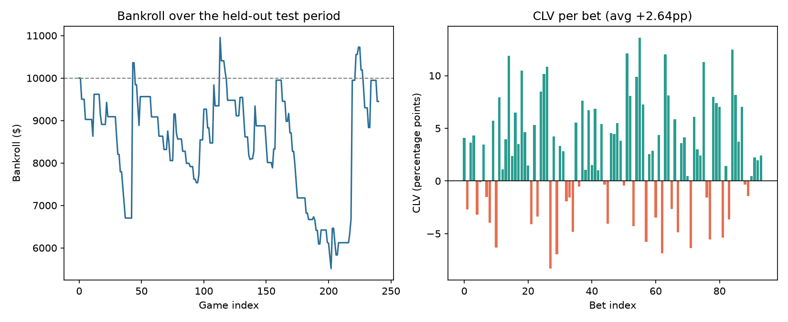

# Backtest Report

Training period: 2024-10-22 to 2025-03-09 (960 games)
Held-out test period: 2025-03-09 to 2025-04-12 (240 games)

## Results

- **Average CLV (the metric that matters more than raw ROI over a small sample): +2.64 percentage points**
- ROI: -5.50%
- Sharpe-like ratio: 0.035
- Max drawdown: -49.68%
- Hit rate: 29.8%
- Bets placed: 94 / 240 games scanned
- Final bankroll: $9,449.52 (started at $10,000.00)

