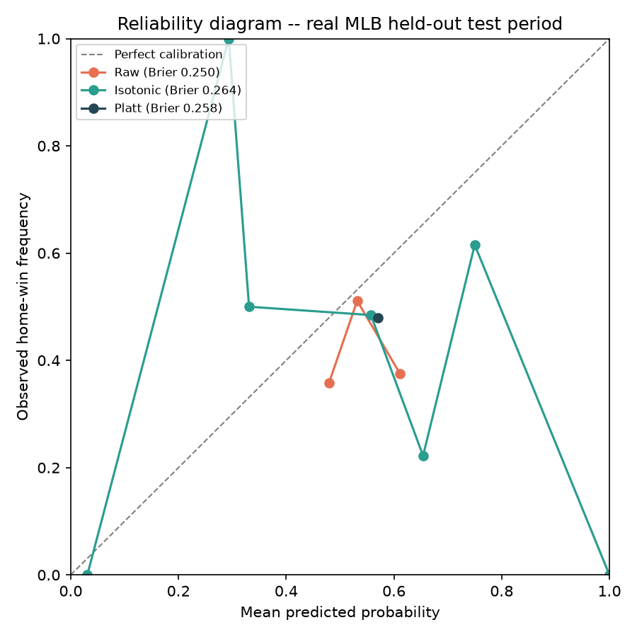

# Real MLB Model Report

Trained and evaluated on real completed MLB games from statsapi.mlb.com (free, public, no key required) -- real teams, real dates, real final scores. No backtest/CLV section: The Odds API's free tier has no historical odds endpoint, so there's no real historical market price to size bets against.

Feature rows: 1430, from 2026-03-27 to 2026-07-16 (first game of the season for each team is dropped -- no prior history to build features from)
Training period: 2026-03-27 to 2026-06-22 (1144 games)
Held-out test period: 2026-06-22 to 2026-07-16 (286 games)

## Model vs. naive baselines (real held-out games)

| Predictor | Accuracy | AUC | Log loss | Brier score |
|---|---|---|---|---|
| Model (logistic regression) | 0.490 | 0.560 | 0.6957 | 0.2513 |
| Always predict home team (training home-win rate) | 0.479 | 0.500 | 0.6976 | 0.2522 |
| Coin flip | 0.479 | 0.500 | 0.6931 | 0.2500 |

## Is this significant, or just this test period? (bootstrap 90% CI)

- Test accuracy: 0.490, 90% CI [0.441, 0.538]
- Log-loss improvement over the home-rate baseline (per game, positive = model better): +0.0019, 90% CI [-0.0038, +0.0075]

## Calibration

Calibration set: 172 real games, carved out of the training period, never the test period.

- Brier score, raw: 0.2501
- Brier score, isotonic-calibrated: 0.2640
- Brier score, Platt-calibrated: 0.2579

