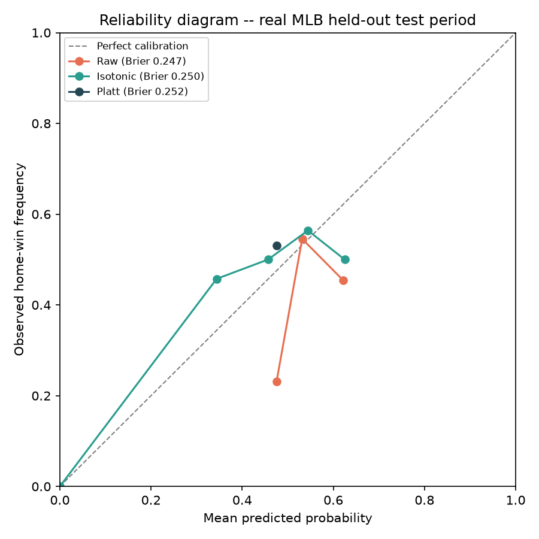

# Real MLB Model Report

Trained and evaluated on real completed MLB games from statsapi.mlb.com (free, public, no key required) -- real teams, real dates, real final scores. No backtest/CLV section: The Odds API's free tier has no historical odds endpoint, so there's no real historical market price to size bets against.

Feature rows: 1715, from 2026-03-27 to 2026-08-06 (first game of the season for each team is dropped -- no prior history to build features from)
Training period: 2026-03-27 to 2026-07-09 (1372 games)
Held-out test period: 2026-07-09 to 2026-08-06 (343 games)

## Model vs. naive baselines (real held-out games)

| Predictor | Accuracy | AUC | Log loss | Brier score |
|---|---|---|---|---|
| Model (logistic regression) | 0.554 | 0.584 | 0.6858 | 0.2464 |
| Always predict home team (training home-win rate) | 0.531 | 0.500 | 0.6914 | 0.2491 |
| Coin flip | 0.531 | 0.500 | 0.6931 | 0.2500 |

## Is this significant, or just this test period? (bootstrap 90% CI)

- Test accuracy: 0.554, 90% CI [0.510, 0.598]
- Log-loss improvement over the home-rate baseline (per game, positive = model better): +0.0056, 90% CI [+0.0011, +0.0101]

## Calibration

Calibration set: 206 real games, carved out of the training period, never the test period.

- Brier score, raw: 0.2468
- Brier score, isotonic-calibrated: 0.2500
- Brier score, Platt-calibrated: 0.2519

