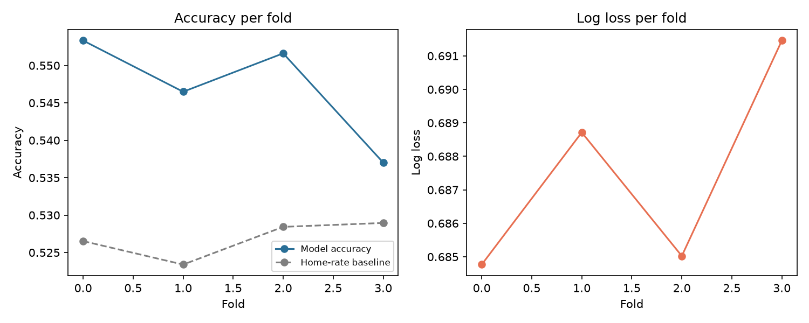
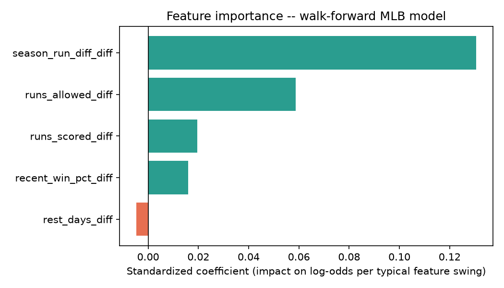

# Walk-Forward MLB Model Evaluation

A more rigorous evaluation of the same real MLB model in `results/mlb_model_report.md` (same six team-level features, same logistic regression) -- multiple real seasons instead of one, walk-forward folds instead of a single 80/20 split, a regularization search inside each fold's training data, feature importance, and error analysis pooled across every fold's held-out predictions.

## Data

Real completed games by season (statsapi.mlb.com): 2023: 2433, 2024: 2428, 2025: 2429, 2026: 1540
Total feature rows after point-in-time engineering: 8768

Rolling team state resets at each season boundary (features are built per season, then concatenated) -- carrying rolling form across an off-season would be both unrealistic and would create spurious rest-days outliers from a ~150-day gap.

## Walk-forward folds

| Fold | Train period | Test period | Train N | Test N | Best C | Accuracy | AUC | Log loss | Brier |
|---|---|---|---|---|---|---|---|---|---|
| 0 | 2023-03-31 to 2023-08-13 | 2023-08-13 to 2024-06-19 | 1753 | 1753 | 0.01 | 0.553 | 0.590 | 0.6848 | 0.2456 |
| 1 | 2023-03-31 to 2024-06-19 | 2024-06-19 to 2025-04-30 | 3506 | 1753 | 0.01 | 0.546 | 0.556 | 0.6887 | 0.2475 |
| 2 | 2023-03-31 to 2025-04-30 | 2025-04-30 to 2025-09-11 | 5259 | 1753 | 0.01 | 0.552 | 0.557 | 0.6850 | 0.2460 |
| 3 | 2023-03-31 to 2025-09-11 | 2025-09-12 to 2026-07-23 | 7012 | 1756 | 0.1 | 0.537 | 0.534 | 0.6915 | 0.2492 |

## Stability across folds (mean +/- std)

- Accuracy: 0.547 +/- 0.007
- AUC: 0.559 +/- 0.023
- Log loss: 0.6875 +/- 0.0032
- Brier score: 0.2471 +/- 0.0016

## Is the pooled edge real? (bootstrap 90% CI, all folds' held-out predictions pooled)

Log-loss improvement over each fold's own home-rate baseline: +0.0042, 90% CI [+0.0021, +0.0061] -- excludes zero: significant on the pooled sample.

## Feature importance (standardized coefficients)

From a final model fit on all 8768 available rows (C=0.01 via the same regularization search) -- used only for interpretability, never for evaluation.

| Feature | Raw coefficient | Feature std dev | Standardized coefficient |
|---|---|---|---|
| season_run_diff_diff | +0.0704 | 1.856 | +0.1306 |
| runs_allowed_diff | +0.0522 | 1.125 | +0.0587 |
| runs_scored_diff | +0.0182 | 1.075 | +0.0195 |
| recent_win_pct_diff | +0.0563 | 0.282 | +0.0159 |
| rest_days_diff | -0.0173 | 0.272 | -0.0047 |

## Error analysis: by prediction confidence

Pooled held-out predictions bucketed by |model probability - 0.5| -- a model with real signal should do better on its more confident calls.

| Confidence bucket | N | Accuracy | Log loss |
|---|---|---|---|
| (-0.0009713, 0.0128] | 1403 | 0.503 | 0.6929 |
| (0.0128, 0.0261] | 1403 | 0.516 | 0.6928 |
| (0.0261, 0.0414] | 1403 | 0.561 | 0.6868 |
| (0.0414, 0.0621] | 1403 | 0.559 | 0.6863 |
| (0.0621, 0.467] | 1403 | 0.597 | 0.6786 |

## Error analysis: by season

Pooled held-out predictions grouped by season -- does performance hold up across different years, or was one season doing all the work?

| Season | N | Accuracy | Log loss |
|---|---|---|---|
| 2023 | 665 | 0.540 | 0.6837 |
| 2024 | 2412 | 0.552 | 0.6860 |
| 2025 | 2413 | 0.555 | 0.6864 |
| 2026 | 1525 | 0.530 | 0.6933 |
